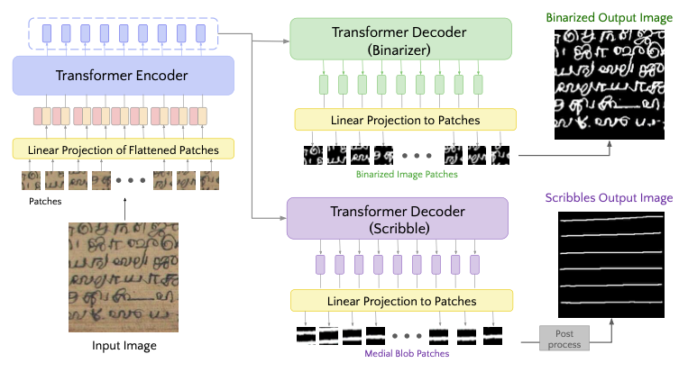
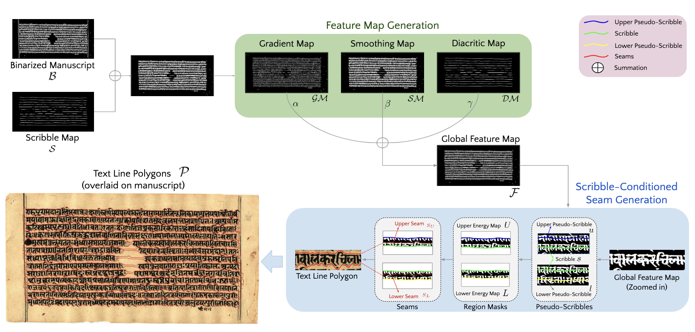

# SeamFormer

This repository contains the public implementation of SeamFormer, A High Precision Text Line Segmentation for Handwritten Document presented in the ICDAR 2023 paper. 

This repository is a one-click setup, where the pipeline automatically captures evaluation metrics and visual results immediately after inference is triggered. In addition, we support both offline and online logging, with the option to directly log data to the user's WandB account. 

## Table of contents
---
1. [Getting Started](#getting-started)
2. [Model Overview](#model)
3. [Model Inference](#model)
4. [Training](#model)
    - [Preparing Data](#preparing-the-data)
    - [Preparing Configs](#Preparing-the-configuration-files)
    - [Stage-1](#stage-1)
    - [Stage-2](#stage-2)
5. [Pretrained Weights](#pretrained-weights) 
5. [Visual Results](#visual-results) 
5. [Finetuning](#finetuning) 
6. [Citation](#citation)
6. [Contact](#contact)

## Getting Started
---
To make the code run, install the necessary libraries preferably using [conda](https://www.anaconda.com/) or else [pip](https://pip.pypa.io/en/stable/) environment manager.

```bash
conda create -n stage1 python=3.7.11
conda activate stage1
pip install -r stage1_requirements.txt
```

## Model 
---
Overall Two-stage Architecture: Stage-1 generated binarised output with just text content along with a scribble map. Stage-2 uses these two intermediate outputs to generate Seams and finally the required text-line segmentation. 

<div align="center">


</div>

<br>
Stage - 1: Uses Encoder-Decoder based multi-task vision transformer to generate binarisation result in one branch and scribble(strike-through lines) in another branch.

<div align="center">

    
</div>

<br>
Stage - 2: Uses binarisation and scribble output from previous stage to create custom energy map for Seam generation. Using which final text-line segments are produced

<br>

<div align="center">

    
</div>


## Model Inference
---

### Usage
- Access via [Colab file]() or [Python file]().
- For Python file
  - You can either provide json file or image folder path.

## Training
---
The SeamFormer is split into two parts:
- Stage-1: Binarisation and Scribble Generation
- Stage-2: Seam generation and final segmentation prediction

<br>

### Preparing the Data
To train the model dataset should be in a folder following the hierarchy: 

```
├── Dataset
│   ├── <Dataset>_Train
│   │   ├── images
│   │   ├── binaryImages
│   │   ├── <Dataset>_TRAIN.json
│   ├── <Dataset>_Test
│   │   ├── images
│   │   ├── binaryImages
│   │   ├── <Dataset>_TEST.json
│
├── ...
```

#### Sample Sundanese input images

 <br><br>


### Preparing the configuration files

`<dataset_name>_<exp_name>_Configuration.json`


  | Parameters  | Description | Default Value
  | ----------  | ----------- | ------------- |
  | dataset_code   | Short name for Dataset   | I2 | 
  | wid   | WandB experiment Name   | I2_train | 
  | data_path   | Dataset path   | /data/ | 
  | model_weights_path   | Path location to store trained weights  | /weights/ | 
  | visualisation_folder   | Folder path to store visualisation results | /vis_results/ | 
  | learning_rate   | Initial learning rate of optimizer (scheduler applied) | $0.005-0.0009$ | 
  | weight_logging_interval  | Epoch interval to store weights, i.e 3 -> Store weight every 3 epoch    | $3$ | 
  | img_size   | ViT input size    | $256 \times 256$| 
  | patch_size   | ViT patch size   | $8 \times 8$ | 
  | encoder_layers   | Number of encoder layers in stage-1 multi-task transformer   | $6$ | 
  | encoder_heads   | Number of heads in MHSA    | $8$ | 
  | encoder_dims   | Dimension of token in encoder   | $768$ | 
  | batch_size   | Batch size for training   | $4$ | 
  | num_epochs   | Total epochs for training   | $30$ | 
  | mode   | Flag to train or test. Either use "train"/"test"   | "train" | 
  | train_scribble   | Enables scribble branch train  | false| 
  | train_binary  | Enables binary branch train   | true | 
  | pretrained_weights_path   | Path location for pretrained weights(either for scribble/binarisation)   | /weights/ | 
  | enableWandb  | Enable it if you have wandB configured, else the results are stored locally in  `visualisation_folder`  | false |


### Stage-1
Stage 1 comprises of a multi-task tranformer for binarisation and scribble generation.


#### Sample train/test.json file structure
```bash
[
  {"imgPath": ".data/<Dataset>/<Dataset>_Train/imgs/palm_leaf_1.jpg",
   "gdPolygons": [[[x11,y11],[x12,y12]...],[[x21,y21],[x22,y22]...], ...],
   "scribbles": [[[x11,y11],[x12,y12]...],[[x21,y21],[x22,y22]...], ...]
  } ,
  ...
]
```

#### Data Preparation for Binarisation and Scribble Generation
```bash
python datapreparation.py \
 --datafolder '.data/' \
 --outputfolderPath '.data/<Dataset>_train_patches' \
 --inputjsonPath '.data/<Dataset>/<Dataset>_Train/train.json' \
 --binaryFolderPath '.data/<Dataset>/<Dataset>_Train/bin_imges'

python datapreparation.py \
 --datafolder '.data/' \
 --outputfolderPath '.data/<Dataset>_test_patches' \
 --inputjsonPath '.data/<Dataset>/<Dataset>_Test/test.json' \
 --binaryFolderPath '.data/<Dataset>/<Dataset>_Test/bin_imges'
```

#### Training Binarisation branch
```bash
python train.py --exp_json_path '<Dataset>_exp1_Configuration.json' --mode 'train' --train_binary
```


#### Training Scribble generation branch 
```bash
python train.py --exp_json_path '<Dataset>_exp1_Configuration.json' --mode 'train' --train_scribble

```


### Stage-2

---

## Pretrained Weights

Download Pretrained weights for binarisation from this [drive link]() and change the *pretrained_weights_path* in the json files in `configs` directory accordingly.

---

## Visual Results
From top left, clockwise - Bhoomi, Penn In hand, Khmer, Jain.

  

---

## Finetuning
- Parameters that are to carefully configured.
  - In `datapreparation.py`
    - THICKNESS - This parameter defines the thickness of scribble ground truth. Reduce this as needed if the predicted scribbles are so thick so that two scribbles merge into one.
    - OVERLAP - If you think you have fewer number of palm-leaf images, increase overlap to 0.5 or 0.75 so that you get more training patches.

- Choose learning rate and a finetuning strategy (refer topic 'When and how to fine-tune' in [CS231n Notes](https://cs231n.github.io/transfer-learning/)) based on available data at hand and its closeness to pretrained data. 
  - You can choose to unfreeze decoder(for binariser/scribble branch) alone and train decoder alone. 
  - Or you can choose to unfreeze both decoder and encoder for binarisation, but it is preferred to always freeze encoder during scribble generation and only finetune its decoder.
  - Freezing and unfreezing parameters can be configured in `builModel()` in `train.py` using the command `param.requires_grad = False`  appropriately
    - By default 
      - During Binarisation: Scribble branch's decoder is freezed
      - During Scribble Generation: Binary branch's decoder and also the encoder is freezed.

- Configuration of GPU that we used and typical training time.
  - Single *NVIDIA GeForce GTX 1080 Ti* GPU, 12 GB of GDDR5X VRAM
  - If you use a setup with say around 1000 train images and 0% overlap, it would take ~10 hours. Susceptible to image resolution and overlap percentage, ofcourse.

- Refer sample training setup that we used for Sundanese Dataset [here](Sundanese/README.md).

## Citation

---

---
## Contact 
For any suggestions/contributions to the repository , please contact : <br />
Niharika Vadlamudi - niharika11988@gmail.com / niharika.vadlamudi@research.iiit.ac.in


### To do:
- rename config file